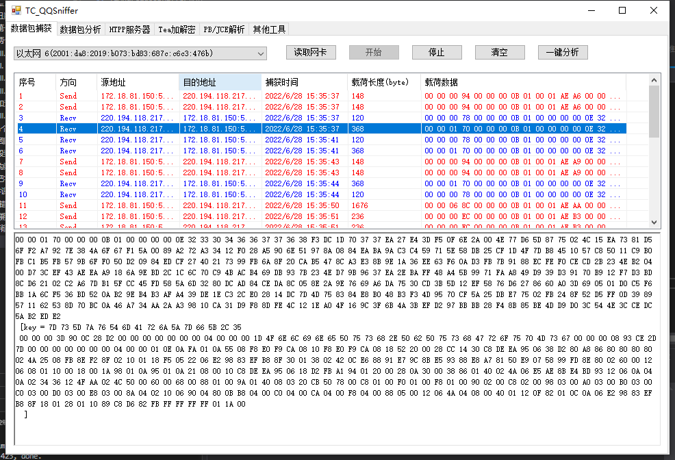
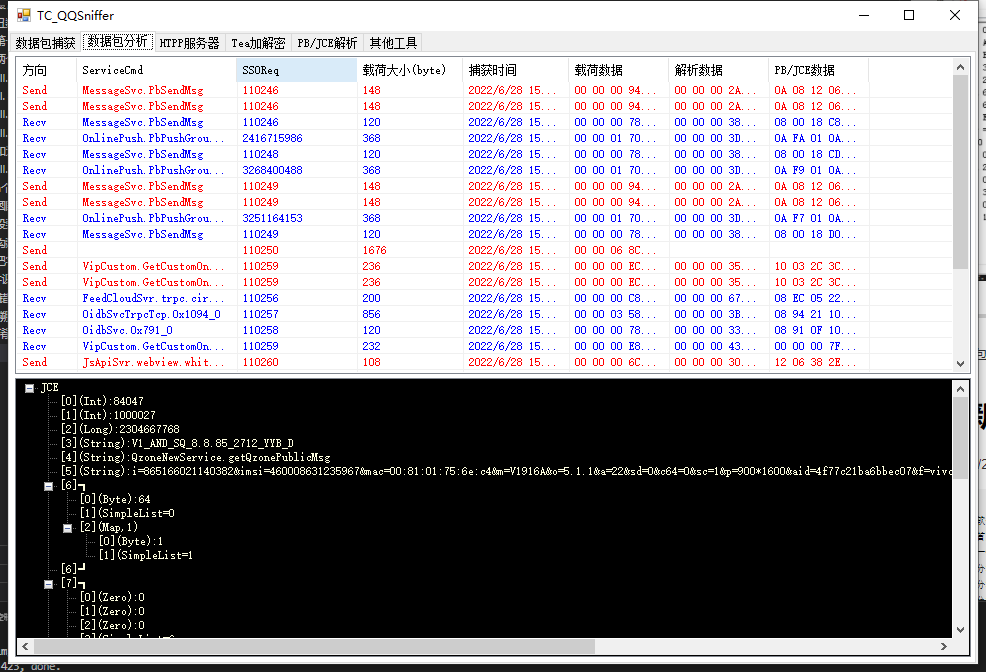
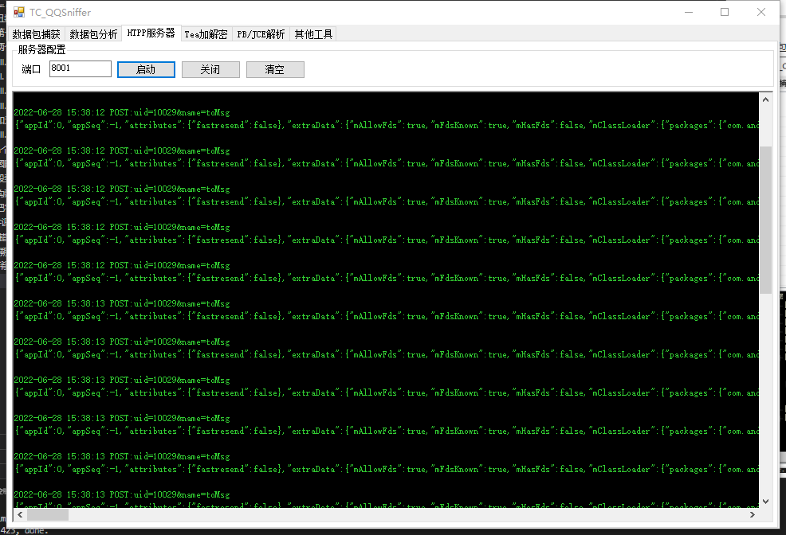
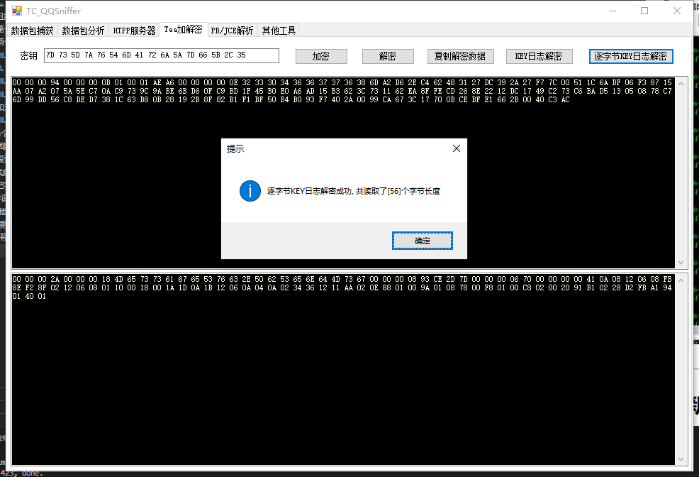
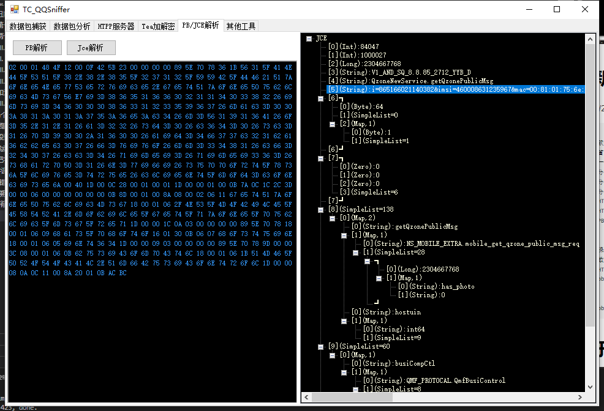
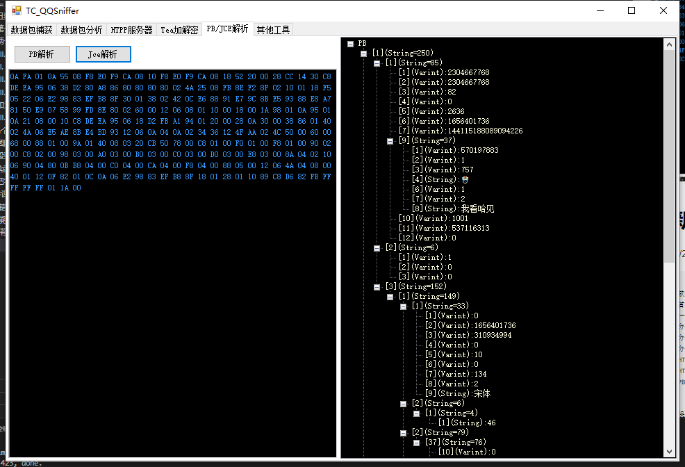
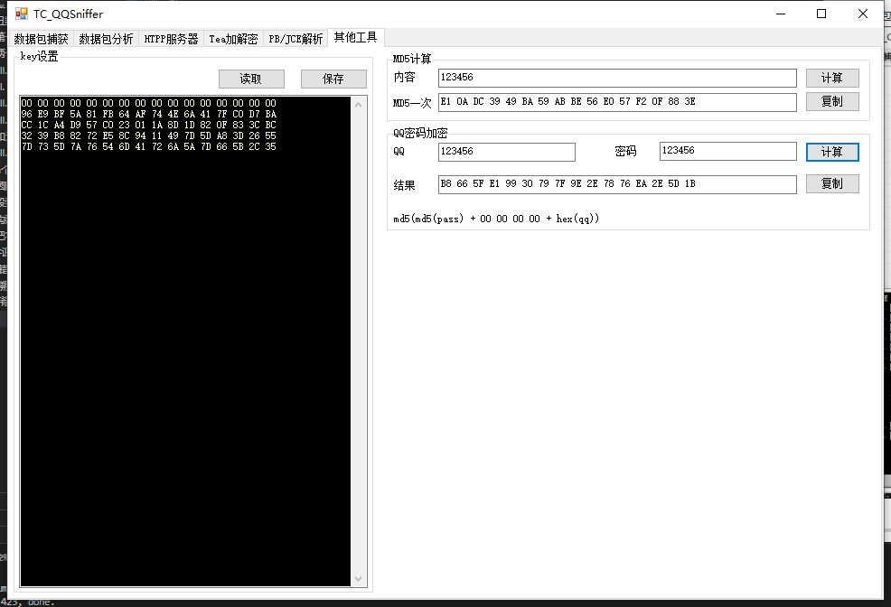

# 项目地址

[https://github.com/touale/TCSniffer](https://github.com/touale/TCSniffer)

# 前言

在TC_QQSniffer出来前，对于QQ协议分析过程存在很多问题，整个过程是非常麻烦的:
1. 分析QQ协议需要利用YgAndroidQQSniffer进行数据包捕获
2. birdSniffer**仅能密钥监听**，虽该软件内置数据包监听功能，但由于是基于e语言开发，**极易出现软件崩溃以及窗口响应卡顿等问题**
3. 具体数据包解析过程，需要先复制载荷数据，然后TEA解析数据，再然后还要感觉hex前四位进行数据分析，最后还要利用外部软件PB/JCE进行解析，**过程繁琐**
4. YgAndroidQQSniffer虽内置了HTTP服务器功能，但由于与大众常用的小鸟hook**数据包不兼容**，使得密钥监听无法实现。
5. YgAndroidQQSniffer提供了pb/jce解析接口，但由于历史原因，作者通过外部调用第三方解析程序实现，又由于第三方程序丢失问题，使得**解析无法顺利进行**
6. YgAndroidQQSniffer提供了一键分析功能，但仅对serviceCmd进行解析，**未对body数据解析**，使得若对多数据包body分析时需要对每一个数据分进行手动分析
7. 在外界很多兴趣爱好者根据个人喜好开发了一系列雷同解析工具，虽在功能上大体一致，但由于**国内作者的闭源性**，使得该类程序收费使用，初来乍到的兴趣爱好者**无法享受工具的便利**

- - -
针对上述问题，4月份个人计划并开发了安卓QQ数据包自解析软件，该软件主要以e语言为底层，旨在针对上述的具体的数据包解析，但同时引入了**新的问题**：

1. 从引用三个软件变成了**引用四个软件**
2. 对于逐字节TEA解密过程，需要不断变更原始数据以及遍历密钥，这个过程花费**时间非常久**，并且稍有不慎**存在崩溃**等问题
3. 多软件配合的情况下**使得分析过程愈加混乱**

- - -
因此，个人决定从根源出发，TC_QQSniffer旨在以一种**删繁就简原则**对整个过程进行休整，站在前人的肩膀基于YgAndroidQQSniffer进行开发，同时也减少大量工作量，最初开发初心是打造一个YgAndroidQQSniffer的**plus版**，针对他的优点进行**发扬**，同时对其缺陷进行**改善和补**充，推出一个更好易用的分析工具，并且将其源代码**开源**至GitHub上。
- - -

# 软件介绍

1.数据包捕获


- - -

2.数据包分析



- - -

3.HTTP服务器密钥监听



- - -

4.・TEA加解密，同时支持模糊解密



- - -

5.JCE数据解析



- - -

6.PB数据解析



- - -

7.其他工具




- - -

# 更新日志：
2022/6/28 Version 1.0
```
新增类：
1.新增软件初始化自动读取网卡信息
2.新增首页分析编辑框Tea逐字节解密
3.新增一键分析出解析数据和PB/JCE数据
4.新增分析列表右键复制解析数据、PB/JCE数据和ServiceCmd
5.新增分析列表右键解析出PB/JCE数据成树状数据
6.新增分析列表右键快速解析
7.新增HTTP服务器兼容小鸟hook数据包解析
8.新增HTTP服务器自动解析并保存shareKey、sessionKey等key信息
9.新增PB/JCE栏目，快速解析外部pb/jce数据

优化类：
1.优化保存数据包和读入数据包的密钥读取
2.优化数据包捕获开始和停止的状态信息反馈
3.优化HTPP服务器日志显示
4.优化pb/jce数据解析格式显示

修复类：
1.修复pb数据double和float数据解析异常问题
```


# 关于其他计划：
```
1.计划加入对pb/jce树形框的右键等功能支持
2.计划加入对zlib库对压缩型数据的压缩和解压支持
3.支持对更多的TLV数据解析
4.加入对登录包和功能包的数据格式化
```

- - -
# 引用

[PB-JCE-Decoder-](https://github.com/laomms/PB-JCE-Decoder-)
[androidqq-sniffer](https://github.com/yggo/androidqq-sniffer)